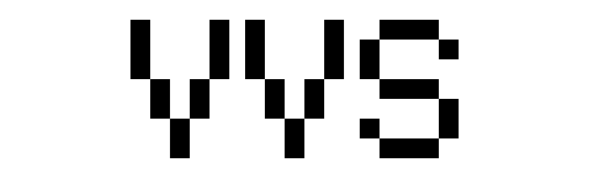

<div align="center">
  
</div>

```bash
$ whoami
Vsevolod Sanko — CS student @ SPbPU · Saint Petersburg
focus: algorithms · automata theory · NLP · math

$ uname -a
Python 3.x  C++17  Haskell  LaTeX  CLIPS  SQL
```

---

```bash
$ ls skills/
```

| Systems | Data & Math | Tools |
|---------|-------------|-------|
| C++ · Qt5/6 | Python · NumPy | Git · Linux |
| Haskell | ML · NLP | LaTeX |
| Logisim | pymorphy2 · NLTK | Multisim · aiogram |

---

```bash
$ cat projects.txt
```

```
→ TheoryOfAlgorithm    Von Neumann CA · rule 59350005 · Wolfram Class IV
→ TheoryOfAutomats     16-state Mealy FSM · digital clock synthesis
→ ExpertSystems        CLIPS rule engine · pizza recommender + DHCP diagnostics
→ Graph                Kirchhoff · Kruskal · Ford-Fulkerson · Champernowne PDF
→ Hash_KB_RLE_Fano     Red-Black tree · Shannon-Fano · RLE · hash table
→ SheludeBot           Telegram bot · FSM · Haversine · SPbPU schedule scraper
→ UnoGame              Observer pattern · SmartBot · 108-card deck · C++
→ Haskell              BMP processor · chroma key · 10+ effects · undo/redo
```

---

```bash
$ ./contact --all
```

```
github:   github.com/seva-sanko
email:    fila545544@gmail.com
uni:      Peter the Great St. Petersburg Polytechnic University
```

<div align="center">
  
  
</div>
